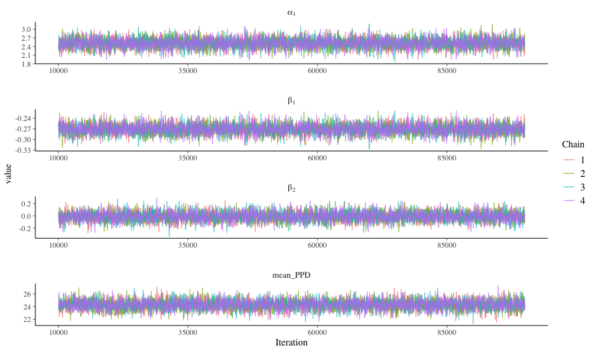
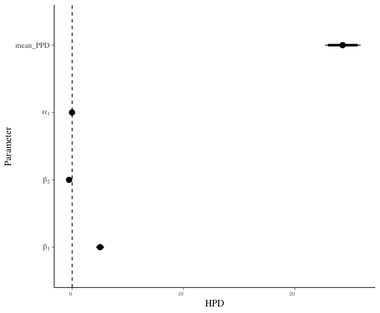
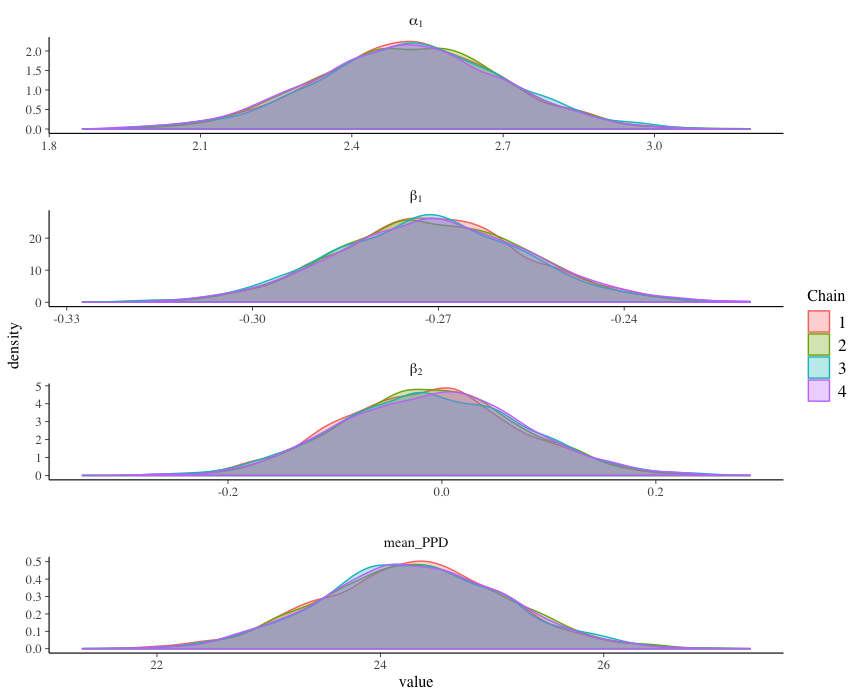

README
================
Raul JTA
03/08/2019

Overview
--------

Bayesian inference is an alternative, but principled approach to inference which seamlessly combines new evidence with prior beliefs. Instead of constructing the likelihood and deriving point and interval estimates like any frequentist would do, bayesians shift their attention onto the posterior distribution *p*(*θ*|*y*) when it is time to perform inference. At its core, their approach relies on specifying some likelihood and prior, which through derivation or algorithms leads to the desired posterior. This is the key idea: *p*(*θ*|*y*)∝*p*(*y*|*θ*)*p*(*θ*).

Technical
---------

All coding including this README file were generated through `R` and `RMarkdown`. In addition, this is a `packrat` project, which means that you may have to install the package `packrat` in an effort to ensure further reproducibility, a seed was set on the fitting algorithms.

Code overview
-------------

Coding in bayesian inference comes surprisingly easy through the `rstanarm` which prepends `stan_` to many familiar model calls, e.g. `stan_lmer()`. There is much flexibility in bayesian inference that is not directly included. For likelihoods and priors not aleady included in the `rstanarm` package, you can write a custom `stan` file and load it into use within R through the `rstan` package. For even more complex models, R can interact with `JAGS` software to construct models such as a functional bayesian model. In contrast to this, or even the [examples found here](http://mc-stan.org/rstanarm/articles/index.html), the following example we provide is very easy, hopefully instructive, and consists of two key parts:

1.  **Fitting bayesian model** - fit a negative binomial model through `rstanarm::stan_glm()` on a small dataset; for instruction we also constrast bayesian estimates against frequentist estimates.
2.  **Visualizing estimates** - construct trace plot for diagostics, density plots to view the distribution of steps for the multiple MCMC chains, and caterpillar plots to simply view estiamtes all through the `ggmcmc` package.

Bayesian overview
-----------------

Prior to introducing the workflow common to all bayesian analyses, we'll touch on the utilities and some theory, most of it coming from Gelman et al. (2013). Complex models, robust estimation, sequential analyses, and intuitive interpretations are all properties which make bayesian inference the ideal option in certain scenarios. Here are those attrative properties in greater detail:

1.  **Common-sense interpretations**- of statistical conclusions; most notably its interpretation of "credible" intervals.

2.  **Bayesian updating**- iterative application of Bayes' rule enables one to update previous conclusions with new data; sequential analyses are done this way with relative ease.

3.  **Robustness**- through an informative prior, estimates are robust to small and low-quality samples.

4.  **Accomodates complex models**- through an algorithmic estimation procedure (i.e. sampling from the posterior), a wide variety of complex modeling scenarios such as hierarchical and missing data problems all fall under one encompassing estimation approach.

A common misconception is that bayesian inference assumes that parameters are random and data fixed, which is the opposite of what frequentists assume; but the truth is deeper than that. Both schools of thought are in fact united in their attempt to learn about a parameter *θ* which represents some real phenomena out in the world. To flesh out this idea, consider this illuminating quote by Greenland (2006), reproduced in full:

> It is often said (incorrectly) that ‘parameters are treated as fixed by the frequentist but as random by the Bayesian’. For frequentists and Bayesians alike, the value of a parameter may have been fixed from the start or may have been generated from a physically random mechanism. In either case, both suppose it has taken on some fixed value that we would like to know. The Bayesian uses formal probability models to express personal uncertainty about that value. The ‘randomness’ in these models represents personal uncertainty about the parameter’s value; it is not a property of the parameter (although we should hope it accurately reflects properties of the mechanisms that produced the parameter).

In other words, frequentists and bayesians alike are looking to extract insight about some parameter *θ* which corresponds to some tangible thing *out in the world*, which may or may not be fixed in reality. Taking one approach over another is not a comment on whether the phenomena itself is fixed, but merely expresses a preference in dealing with the uncertainty around the value of interest. Philosophy aside, here are some helpful notes on priors and posteriors.

### Priors

Prior distributions represent subjective prior beliefs on how the target parameter might be distributed. They may contain differing levels of information relative to the likelihood (e.g. strongly informative, weakly informative), and are additionally either proper, or inproper. There are three primary types:

1.  **Conjugate Priors**- analytically convenient priors which, when paired with data of some given distribution, *always* yield a posterior within the same family of the prior distribution. In updating scenarios (i.e. dynamic studies), these priors can be nicely interpreted as prior data. An exhaustive list of conjugate priors is nicely included in Fink (1997)

2.  **Noninformative Priors**- unassuming prior which reflects trivial or non-existent information. Intuitive choice is a flat prior (*U*(0, 1)), which equally weights all the possible parameter values. More rigorously, Jeffrey's prior uses an invariance argument for strictly defining non-informative prior distributions of *θ*.

3.  **Improper Priors**- prior which either depends on the data, or does not integrate well; some noninformative priors are improper.

### Posteriors

Posteriors reflect the distribution of *θ* given some data, i.e. *p*(*θ*|*y*). All inferential quantities "fall out of the posterior":

1.  **Point Estimates**- summary value of *θ* based on *p*(*θ*|*y*), e.g. mean, median, mode ( *note: all of these are the same if distribution is symmetric*). To obtain these, we must minimize some loss function, e.g. mean minimizes *L*2 loss, median the *L*1 loss, and mode the 0-1 loss.

2.  **Interval Estimates**- 100%(1-*α*) credible set for *θ* is given by some subset *C* ∈ *Θ* *s**i**t*. 1 − *α* ≤ ∫*C**p*(*θ*|*y*)*d**θ*. Mathematically put, the attracive interpretation of the credible interval is that *P*(*θ* ∈ *C*)≥0.95.

Above we see a caterpillar plot illustrating point estimates and corresponding confidence intervals, and a dotted line at x = 0. With the basics in tow, we now introduce the workflow common to bayesian analysis.

Bayesian workflow
-----------------

1.  **Specify full probability model** - identify an appropritate model for the relationship between outcome of interest **y**, and a set of covariates **X**.

2.  **Propose prior beliefs** - identify distributions for the parameters (joint or marginal) which represent prior information, specifically suggesting the distribution of their probability.

3.  **Work on the posterior** - with a likelihood and prior in place, now is the time to extract (through derivation or sampling algorithms) and analyze the posterior distribution.

4.  **Evaluate model** - evaluate model fit, implications, and sensitivity through scrutiny and sensitivity analyses (for violated assumptions).

Notice that only step 2 and 3 deviate from the typical frequentist analysis. At the end of our analysis, we can create a density plot to help visualize how different methods would yield different point and interval estimates, for each parameter and across the all of the chains.

It is remarkable and slightly puzzling that one can start at the same likelihood, proceed in a completely new manner to perform inference, and yet still arrive at practically identical points. Not only has bayesian inference taken root in a wide array of fields, it has truly *cracked open* the core of statistics at a methodological and conceptual level. Its existence continues to breathe life and ingenuity into the science of variation some of us practice as statisticians.

References
----------

Fink, Daniel. 1997. “A Compendium of Conjugate Priors.” <https://www.johndcook.com//CompendiumOfConjugatePriors.pdf>.

Gelman, Andrew, John Carlin, Hal Stern, David Dunson, Aki Vehtari, and Donald Rubin. 2013. *Bayesian Data Analysis, Third Edition (Chapman & Hall/CRC Texts in Statistical Science)*. Third. London: Hardcover; Chapman; Hall/CRC. [http://www.amazon.com/exec/obidos/redirect?tag=citeulike07-20\\&path=ASIN/1439840954](http://www.amazon.com/exec/obidos/redirect?tag=citeulike07-20\&path=ASIN/1439840954).

Greenland, Sander. 2006. “Bayesian Perspectives for Epidemiological Research: I. Foundations and Basic Methods.” *International Journal of Epidemiology* 35 (3): 765–75. doi:[10.1093/ije/dyi312](https://doi.org/10.1093/ije/dyi312).
